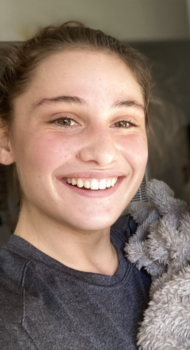

# Members
- Robert Geraghty
- Dom Hankle
- Ethan Hancock
- Drew Rockmore
- Sean Allgaier
- Abigail Eagan
- Adam Adam

 
 
 
 

Robert Geraghty is a network engineer in Alaska. He is is currently designing and building communications infrastructure primarily in Alaska, while providing consulting services across the US. In his free time, Robert likes to hike and spend time in the outdoors.

 
 
 
 

Domenic Hankle is a Computer Science student at ODU expected to graduate in the Fall of 2024.
He currently work at an internship that specifically focuses on web app development for video surveillance software, but also
really enjoys learning about graphics programming in OpenGL and the GLSL shading language. Some hobbies of his include playing soccer and disc golf!

 
 
 
 

Ethan Hancock is a Computer Science student at ODU.
He is passionate about programming, especially in C++, and has even published his own C++ library!
He is also very interested in Linux.

 
 
 
 

Drew Rockmore is a full time computer science student at Old Dominion University studying.
He served in the navy for six years as a AEGIS computer networking technician and currently works part time as web developer. 

 
 
 
 

Sean Allgaier is a full time student at Old Dominion University expecting to graduate in the Fall of 2024.
He is a master cook at Waffle House and in the process of designing a mobile app that will be used to help train new employees. 
One of his bigger hobbies is that he likes to use C++ to build and design different kinds of calculators that are used to make certain aspects of life less tedious. 
 

 
 
 
 

Abigail Eagan is currently a full time student in my last year at Old Dominion University,
securing an undergraduate degree in Computer Science. 
She also works full time running and managing a dessert shop. With an interest in desktop app development, she tentatively looks
into creating custom apps to suit her unique interests and create an entirely personalized laptop.

 
 
 
 

Adam Adam who runs their business while also pursuing a full time degree at ODU they are deeply committed
to both entrepreneurship and education. Their commitment to professional development shines through as they juggle the responsibilities of managing a business alongside advancing their pursuits. Apart from their work and studies they find joy in playing basketball, football and soccer showcasing a rounded approach to life. 
Their main focus in class currently is exploring solutions to tackle challenges, in business environments by working on a technology centered project.

 
 
 
 
